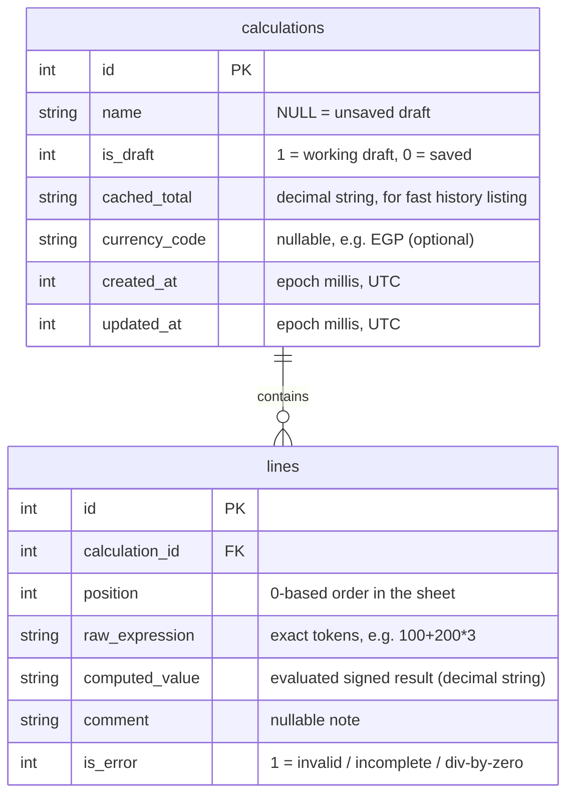

# Notaleq — Data Model, ERD & Schema

A smart, multi-line calculator. Each **line** is an independent calculator
expression that evaluates to one signed number, and the app keeps a **live
running total** of all line results. Every line can have an optional comment.
Calculations can be saved (named) into history, or kept as an auto-persisted
draft.

---

## 1. Entity-Relationship Diagram



Two tables only. `calculations` holds both the current draft (one row,
`is_draft = 1`) and every saved sheet (`is_draft = 0`). `lines` holds the rows
of each sheet.

---

## 2. SQLite DDL

```sql
PRAGMA foreign_keys = ON;

CREATE TABLE calculations (
  id            INTEGER PRIMARY KEY AUTOINCREMENT,
  name          TEXT,                         -- NULL = unsaved draft
  is_draft      INTEGER NOT NULL DEFAULT 1,   -- 1 = working draft, 0 = saved
  cached_total  TEXT    NOT NULL DEFAULT '0', -- decimal string (display/listing)
  currency_code TEXT,                         -- optional, e.g. 'EGP'; NULL = none
  created_at    INTEGER NOT NULL,             -- epoch millis (UTC)
  updated_at    INTEGER NOT NULL
);

CREATE TABLE lines (
  id             INTEGER PRIMARY KEY AUTOINCREMENT,
  calculation_id INTEGER NOT NULL,
  position       INTEGER NOT NULL,            -- 0-based order within the sheet
  raw_expression TEXT    NOT NULL DEFAULT '', -- exact tokens, e.g. "100+200*3"
  computed_value TEXT    NOT NULL DEFAULT '0',-- evaluated signed result (decimal)
  comment        TEXT,                        -- optional note
  is_error       INTEGER NOT NULL DEFAULT 0,  -- 1 = invalid / incomplete / div-by-0
  FOREIGN KEY (calculation_id)
    REFERENCES calculations(id)
    ON DELETE CASCADE
);

CREATE INDEX idx_lines_calc    ON lines(calculation_id, position);
CREATE INDEX idx_calc_updated  ON calculations(updated_at DESC);
CREATE INDEX idx_calc_is_draft ON calculations(is_draft);
```

**Note on IDs:** `INTEGER AUTOINCREMENT` is used for simplicity (local-only
app). If cloud sync is ever added, switch PKs to `TEXT` UUIDs (via the `uuid`
package) so rows merge cleanly across devices.

**Note on money:** all amounts are stored as **decimal strings**, never as
`REAL`/`double`. `double` breaks money math (`0.1 + 0.2 = 0.30000000000000004`).
Compute with the `decimal` package and store/round at display time.

---

## 3. Field reference

### `calculations`
| Field | Meaning |
|---|---|
| `name` | User-chosen name. `NULL` while it's an unsaved draft. |
| `is_draft` | `1` = the active working sheet; `0` = a saved sheet (history). |
| `cached_total` | Last computed total as a decimal string. Cached so the history list renders without re-evaluating every line. |
| `currency_code` | Optional ISO code (e.g. `EGP`). `NULL` = no currency shown. Reserved for future. |
| `created_at` / `updated_at` | Epoch millis (UTC). Display in local timezone. |

### `lines`
| Field | Meaning |
|---|---|
| `position` | 0-based order in the sheet. Re-index on insert / delete / reorder. |
| `raw_expression` | Source of truth — the exact tokens the user typed (`100+200*3`). The evaluator re-parses this; the editor re-loads it when a line is focused. |
| `computed_value` | Cached evaluated result, signed, decimal string. |
| `comment` | Optional. May be `NULL` or empty. A line can be comment-only as a section header (then `computed_value = 0`, excluded from total). |
| `is_error` | `1` if the expression is invalid / incomplete / divides by zero. Error lines are **excluded** from the total. |

---

## 4. Line expression grammar (the per-line calculator)

Each line behaves like Samsung's basic calculator, capped at **3 operands**.

```
line        := sign? operand ( binop operand )?  ( binop operand )?
             |  "(" sign? operand binop operand ")" binop operand
             |  operand binop "(" operand binop operand ")"
operand     := number percent?
number      := digits ( "." digits? )?
sign        := "+" | "-"          // optional leading unary sign
binop       := "+" | "-" | "*" | "/"
percent     := "%"                // postfix modifier, does NOT count as an operand
```

Rules:
- **Input cap — changed from v1 (2 → 1 binary operator).** By product decision
  a line may now hold a leading join operator (§6) **plus at most one** binary
  operator. Pressing a further operator commits the line and descends to a new
  one (carrying that operator). The *evaluator* still accepts up to 3 operands /
  2 binary operators so older saved lines keep working; only live **input** is
  capped at one.
- **Precedence:** `* /` bind before `+ -`. Parentheses override.
- **Leading unary minus** allowed at the start of the line, after `(`, and after
  a binary operator.
- **Percent** is Samsung-style and context-aware: `100 + 10%` → `110`,
  `200 * 50%` → `100`. `%` modifies the operand it follows; it is not a 4th
  operand.
- **Decimal point:** one `.` per number. Leading `.` becomes `0.`. Trailing `.`
  is allowed while typing (`1,000.`). Thousands grouping is applied to the
  **integer part only**, at display time — never to the fractional part.
- **Numbers are Western** (`0123456789`). Display separators: `,` thousands,
  `.` decimal (locale-aware via `intl` if needed).

---

## 5. Input & interaction rules

- **Leading join operator:** a line may start with any of `+ − × ÷` (the tape
  join — see §6). Pressing one on an empty line writes it; pressing another
  replaces it. Every line **after the first value line** must begin with one, so
  while such a line is still empty the number / `.` / `( ) %` keys are
  **disabled** until an operator is pressed.
- **Operator replace:** pressing an operator when the previous token is already
  an operator replaces it (`5 +` then `*` → `5 *`).
- **New-line is blocked while the line is incomplete** — empty, only an
  operator, or ending in a dangling operator (`200 *`). It commits the line and
  creates a new empty line below **only** when the line parses to a valid
  number. Triggers: `↵` key on the numpad, tapping the empty area below, or the
  return/action key of the system keyboard while editing a comment.
- **Backspace `⌫`:** delete the last character of the active line's expression.
- **C (Clear):** clear the **active line** only.
- **AC (All Clear):** clear the **whole sheet** (all lines). Requires
  confirmation.
- **Division by zero / invalid:** set `is_error = 1`; the line is excluded from
  the total (and visually flagged), no crash.

---

## 6. Total — running "tape" model

> **Changed from v1 (sum) → tape.** Originally `total = Σ computed_value`. By
> product decision, lines now form a **running tape**: each line joins the
> result of the lines above it by a leading operator. This is backward
> compatible with the worked example (all `+ / −` lines → still `1750`).

A line may start with a **join operator** (`+ − × ÷`):
- **no leading op / leading `+` / leading `−`** → the whole line is an
  independent expression evaluating to a signed value `v`, **added** to the
  running total (`−1000` adds `-1000`, i.e. subtracts).
- **leading `×` / `÷`** → the operand is whatever follows the operator, and the
  running total is **multiplied / divided** by it.

```
total = 0
for each line in order where is_error = 0 and the line has an expression:
    add:  total += v            # v = signed value of the whole line
    mul:  total *= operand
    div:  total /= operand      # operand ≠ 0 (else the line is is_error)
```

Example: `100` → `×2` → `−50` gives `100 → 200 → 150`.

The join is **derived from `raw_expression`** (its leading operator), so no extra
column is needed. `lines.computed_value` caches the line's operand (the signed
value for an add line, the magnitude for a `× / ÷` line). Recomputed live on
every keystroke / add / edit / delete, then written to
`calculations.cached_total`.

---

## 7. Persistence strategy

**SQLite** (the two tables above):
- The active sheet is continuously written as a draft (`is_draft = 1`) so it
  survives the app being killed.
- **Save** prompts for a name → sets `name`, `is_draft = 0`, then a **fresh
  empty draft** is created and becomes active (the editor "saves and starts a
  new sheet"). Default suggested name = current date/time.
- **History** = all `is_draft = 0` rows, ordered by `updated_at DESC`,
  searchable by `name` and date.
  > **Changed from v1 (tap to load) → tap to view.** By product decision, saved
  > sheets are **read-only**: tapping one opens a detail view (lines + total, no
  > numpad) and never loads it back into the editor. Loading a saved sheet into
  > the live editor let edits silently overwrite history and leaked its name into
  > the next draft, so it was removed. The editor only ever opens a **draft**
  > (`is_draft = 1`); if `active_calculation_id` ever points at a saved row it is
  > ignored and a draft is opened/created instead.
- **AC (clear)** wipes the draft's lines (delete the rows; keep or recreate the
  draft row).

**SharedPreferences** (simple key-values — not in SQLite):
| Key | Purpose |
|---|---|
| `active_calculation_id` | Which **draft** is open in the editor. Saved sheets are read-only and never become the active editor sheet. |
| `sound_enabled` | Click sound on/off. |
| `haptic_enabled` | Vibration on/off. |
| `decimal_places` | Display rounding (default `2`). |
| `currency_code` | App-wide currency, optional. |
| `theme_mode` | light / dark / system. |

---

## 8. Worked example (the original "مصاريف الشهر")

Sheet `name = "مصاريف الشهر"`:

| position | raw_expression | comment | computed_value |
|---|---|---|---|
| 0 | `10000` | المرتب | `10000` |
| 1 | `-1000` | المحامي | `-1000` |
| 2 | `-500` | عزومة | `-500` |
| 3 | `-3000` | ايجار | `-3000` |
| 4 | `-5000` | مصاريف البيت | `-5000` |
| 5 | `2000` | باقي حسابي عند التاجر | `2000` |
| 6 | `-200*4` | الدفعات اللي عليا | `-800` |
| 7 | `100/2` | بتوع الحلاق | `50` |

`cached_total = 1750`  ✓

---

## 9. Out of scope (v1) — future ideas

- Soulver-style **line references** (e.g. "10% of the total above").
- **Currency conversion** (Samsung's own calculator still lacks this — a real
  differentiator).
- **Cloud sync** (would require UUID PKs + a sync layer).
- **Export / share** as PDF or image (you already have this pattern from
  Al-Daftar).
